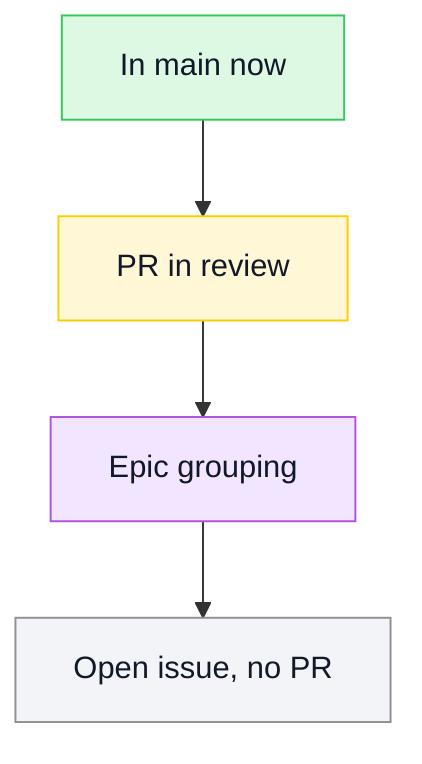
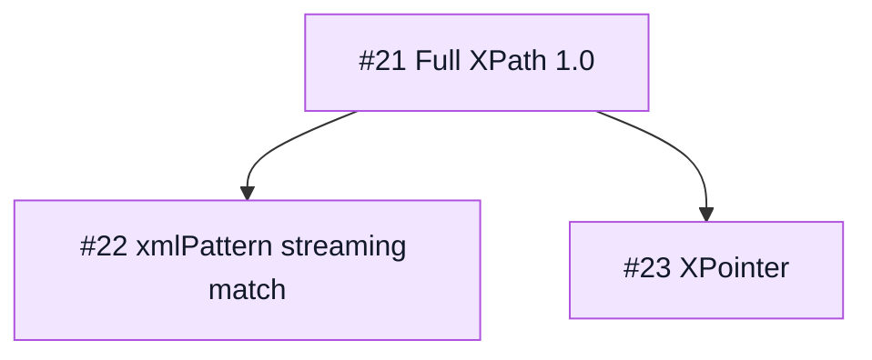
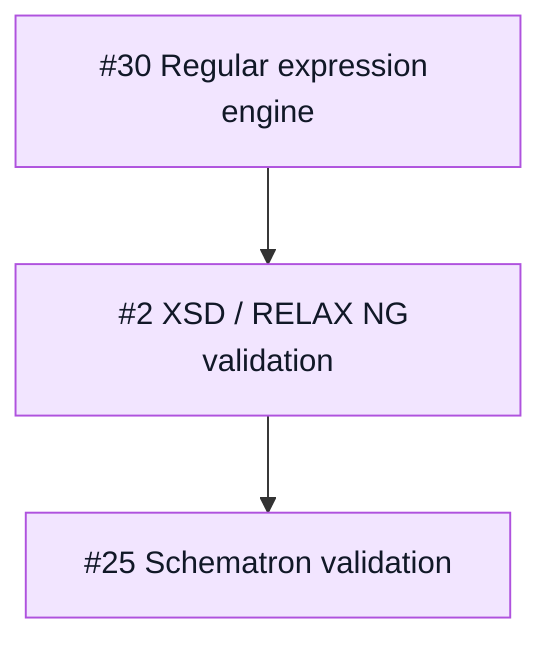
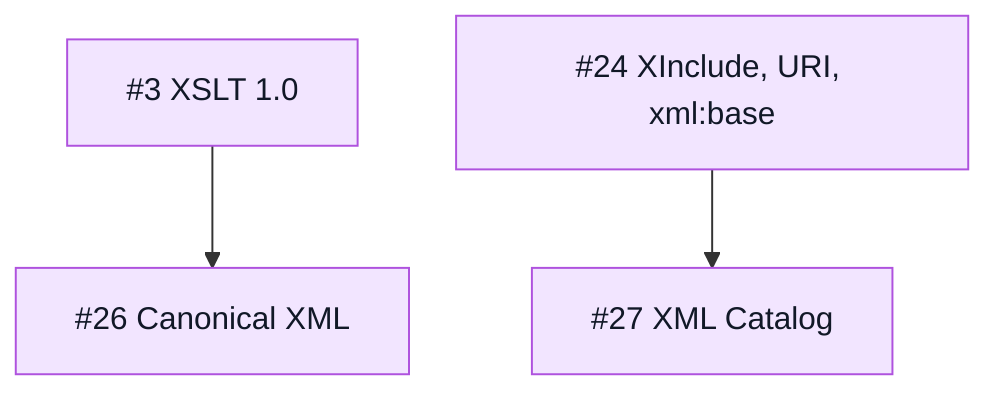

# PureXML

[](https://github.com/mihaelamj/PureXML/actions/workflows/ci.yml)
[](https://github.com/mihaelamj/PureXML/actions/workflows/ci.yml)
[](https://github.com/mihaelamj/PureXML/actions/workflows/ci.yml)

PureXML is a dependency-free XML package written entirely in Swift.

The goal is a Linux-, Windows-, and WebAssembly-compatible XML reader/writer that
does not pull in `libxml2`, `expat`, or Foundation's `XMLParser`. The package is
intentionally strict about portability:

- no external SwiftPM dependencies
- no bundled C sources
- no Foundation requirement in the library target
- root Swift package layout
- macOS, Linux, Windows, and WASI build gates

It is a sibling project to [PureYAML](https://github.com/mihaelamj/PureYAML) and
follows the same structure, rules, and verification gates.

## Roadmap

The roadmap uses the TileDown Mermaid palette: green for shipped work, yellow for
review, purple for epic grouping, and gray for open work.



The goal is full libxml2 feature parity in pure Swift with zero dependencies, by
clean-room reimplementation (behavior reproduced from the private PureXML-research
analysis, no upstream source copied). The streaming core plus DTD validation
(content models, attributes, ID/IDREF) and an XPath 1.0 subset is shipped; the
remaining libxml2 surface is tracked as epics. Deliberate non-goals: network
fetching (`nanohttp`/`nanoftp`) and the threading/memory infrastructure stay out,
and external resolution is opt-in through an injected resolver so XXE stays closed.

Parsing and I/O:

```mermaid
flowchart TB
  classDef done fill:#ddf9e4,stroke:#34c759,color:#111827
  classDef review fill:#fff7d6,stroke:#ffcc00,color:#111827
  classDef epic fill:#f2e5ff,stroke:#af52de,color:#111827
  classDef todo fill:#f2f4f7,stroke:#8e8e93,color:#111827
  Core["Streaming core + DTD validation (shipped)"]:::done
  Push["#1 Push / feed streaming API"]:::epic
  Sax["#19 SAX2 push callbacks"]:::done
  Html["#20 HTML parser and serializer"]:::epic
  Enc["#28 Full encoding support"]:::epic
  Ent["#29 External and parameter entities"]:::epic
  TreeApi["#31 Tree manipulation API"]:::epic
  Writer["#32 xmlTextWriter"]:::epic
  Reader["#33 xmlTextReader with validation"]:::epic
  Save["#34 Serialization option parity"]:::epic
  Chars["#35 Character and name validity"]:::epic
  Core --> Push
  Core --> Sax
  Core --> Html
  Core --> Enc
  Core --> Ent
  Core --> TreeApi
  Core --> Writer
  Core --> Reader
  Core --> Save
  Core --> Chars
```



Querying:



Validation:



Transformation and integrity:



## Status

The node model, the emitter, and a streaming parser are implemented and usable
today.

- **Model** (`PureXML.Model`): `Node`, `Element`, `Attribute`, `QualifiedName`.
  Preserves document order and the distinction between text, CDATA, comments,
  and processing instructions.
- **Emitting** (`PureXML.Emitting`): `Serializer` turns a node tree into
  well-formed XML, with pretty-printed and compact options and correct text and
  attribute escaping.
- **Validation** (`PureXML.Validation`): structural checks such as duplicate
  attribute names. Schema validation (DTD/XSD/RELAX NG) is out of scope for the
  library target.
- **Parsing** (`PureXML.Parsing`): a streaming, iterative parser. `EventReader`
  is a pull-based event core that consumes input through a character-source
  closure and emits one `Event` at a time, never holding the whole document in
  memory (it drives chunked input). `Parser` builds a `Model.Node` tree
  iteratively over the event core. Handles elements, attributes, text, the five
  predefined entities and numeric character references, comments, CDATA, and
  processing instructions. Safe by default: `<!DOCTYPE>` is rejected, which
  removes the DTD-based threat classes (XXE, entity-expansion DoS). DTD support,
  namespaces-as-resolved-URIs, and validation are deliberate future layers.

## Usage

```swift
import PureXML

// Build a tree and emit it (works today).
let element = PureXML.Model.Element(
    "book",
    attributes: [.init("id", "bk101")],
    children: [.element(.init("title", children: [.text("XML Developer's Guide")]))],
)

let xml = PureXML.serialize(.element(element))
try PureXML.validate(.element(element))

// Parse it back into a tree.
let node = try PureXML.parse(xml)

// Or stream events without building a tree (drives chunked input too).
var reader = PureXML.events(xml)
while let event = try reader.next() {
    // handle .startElement / .characters / .endElement / ...
}
```

## Attribution

PureXML is informed by the behavior of established XML parsers (`libxml2`,
`expat`, Foundation's `XMLParser`) and by the W3C XML 1.0 specification, but it
does not copy their implementation into `Sources/`. See
[ATTRIBUTION.md](ATTRIBUTION.md).

## Development Contract

PureXML must stay dependency-free and portable. Before merging changes:

- Swift tools version: 6.1
- Package products: `PureXML`
- SwiftPM dependencies: none
- Hosted CI matrix: macOS, Linux, Windows, and WASM

```sh
bash scripts/check-all.sh
```

That command expands to:

```sh
bash scripts/check-style.sh
bash scripts/check-namespacing.sh
bash scripts/check-forbidden-patterns.sh
swiftformat . --config .swiftformat --lint
swiftlint --config .swiftlint.yml --strict
swift build
swift test
```

## License

MIT.
