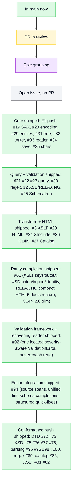
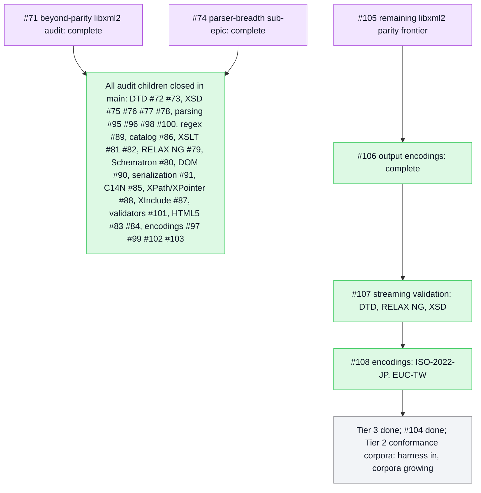

# PureXML

[](https://github.com/mihaelamj/PureXML/actions/workflows/style.yml)
[](https://github.com/mihaelamj/PureXML/actions/workflows/swift-macos.yml)
[](https://github.com/mihaelamj/PureXML/actions/workflows/swift-linux.yml)
[](https://github.com/mihaelamj/PureXML/actions/workflows/swift-windows.yml)
[](https://github.com/mihaelamj/PureXML/actions/workflows/swift-wasm.yml)
[](LICENSE)

PureXML is a dependency-free XML package written entirely in Swift.

The goal is a Linux-, Windows-, and WebAssembly-compatible XML reader/writer that
does not pull in `libxml2`, `expat`, or Foundation's `XMLParser`. The package is
intentionally strict about portability:

- no external SwiftPM dependencies
- no bundled C sources
- no Foundation requirement in the library target
- root Swift package layout
- macOS, Linux, Windows, and WASI build gates

It is a sibling project to [PureYAML](https://github.com/mihaelamj/PureYAML) and
follows the same structure, rules, and verification gates.

## Roadmap

The roadmap uses the TileDown Mermaid palette: green for shipped work, yellow for
review, purple for epic grouping, and gray for open work.



The goal is full libxml2 feature parity in pure Swift with zero dependencies, by
clean-room reimplementation (behavior reproduced from the private PureXML-research
analysis, no upstream source copied). The streaming core, the schema languages
(DTD, XSD, RELAX NG, Schematron), XPath 1.0, and the transform/canonicalization
stack are shipped; the remaining depth gaps are tracked under epic #71. Deliberate
non-goals: network
fetching (`nanohttp`/`nanoftp`) and the threading/memory infrastructure stay out,
and external resolution is opt-in through an injected resolver so XXE stays closed.

The original epics, the documented-subset parity work (#61), the validation
framework and recovering reader (#92), and the editor-integration layer (#94)
are all shipped (summarized above). The beyond-parity libxml2 conformance audit
(#71) and its parser-breadth sub-epic (#74) are now **complete**: every depth gap
the audit surfaced is closed in main. The remaining distance to full libxml2
parity is tracked under epic **#105**: a few concrete features (output encodings,
streaming validation, the last encodings) plus conformance-corpus depth.



## Status

PureXML is a working, dependency-free XML library today: parse, emit, validate,
query, and stream documents on macOS, Linux, Windows, and WASM. The test suite
currently runs **819 tests in 128 suites** (`swift test`).

### Shipped (libxml2-aligned surface)

- **Model** (`PureXML.Model`): `Node`, `Element`, `Attribute`, `QualifiedName`,
  and a mutable `TreeNode` for in-place editing (insert, remove, replace, copy,
  parent navigation).
- **Parsing** (`PureXML.Parsing`): iterative streaming parser over strings,
  bytes, or incremental character/byte sources. Pull events via `EventReader`,
  SAX2-style callbacks via `SAXHandler`, and a pull cursor via `TextReader`
  (libxml2 `xmlTextReader`). Handles elements, attributes, text, predefined and
  numeric entities, comments, CDATA, and processing instructions. Namespace
  bindings (`xmlns`) are resolved to URIs on parse.
- **Encoding**: UTF-8/16/32 (with BOM sniffing), ISO-8859-1, and Windows-1252
  from raw bytes or streaming byte input.
- **DTD (opt-in)**: `<!DOCTYPE>` is **off by default** (`Limits.allowDoctype:
  false`) to keep XXE and entity-expansion closed. When enabled, the internal
  subset is parsed; internal general entities expand with a bounded cap; external
  entities and external subsets are refused unless an injected
  `EntityResolver` supplies replacement text.
- **Validation** (`PureXML.Validation`): one composable framework (the OpenAPIKit
  idiom, parameterized over subject and document) backing structural checks, **DTD
  validation** (content models, attribute lists/defaulting, tokenized types,
  ID/IDREF), **XSD** (datatypes, complex types, derivation control, wildcards,
  namespace qualification), **RELAX NG** (XML and compact syntax), and
  **Schematron** (rules, phases, dynamic messages). Errors are located by coding
  path for editor use.
- **Emitting** (`PureXML.Emitting`): `Serializer` (save options, quote style,
  `xml:space`, line endings) and an incremental, namespace-aware `Writer` (libxml2
  `xmlTextWriter`) with compact and pretty modes.
- **XPath / XPointer** (`PureXML.XPath`): XPath 1.0 (all axes, the core function
  library, eval-time namespace bindings) and XPointer (`element()`, `xpointer()`,
  `xpath1()`, `xmlns()`).

### Consumption modes

You choose how the document is consumed; only the tree mode materializes the whole
document. The input itself never has to be a whole string: every mode below also
accepts an incremental character or byte source (`pulling:` / `pullingBytes:`), so
the engine advances step by step with bounded memory and the bytes are pulled on
demand. The `String` overloads are a convenience for when you already hold the text.

- **Pull cursor (step by step)**: `events(_:)` / `events(pulling:)` returns an
  `EventReader`; call `next()` to get one `Event` at a time. `TextReader` is the
  node cursor (the libxml2 `xmlTextReader` model): `read()` advances to the next
  node, you inspect it, `read()` again. Bounded state, no tree.
- **Push / feed**: `PushParser.feed(_:)`/`finish()` accepts the document in
  arbitrary chunks (a socket, a generator); `events(feeding:)` exposes the same
  over an `AsyncSequence`. It retains only the current incomplete token and the
  open-element stack.
- **SAX**: `parse(_:sax:)` delivers SAX2-style callbacks, no tree.
- **Tree**: `parse`/`parseTree` build a `Model.Node` / `TreeNode` tree for
  random access, mutation, validation, XPath, and XSLT. This mode (like libxml2's
  DOM) holds the whole document, because those operations need the full structure.

### Safe defaults

By default the parser rejects `<!DOCTYPE>` and refuses every external reference
(`EntityResolver.refusing`). Enable DTD processing only when you need internal
subset validation or internal entities, and wire a resolver only for trusted,
in-memory replacements. Network fetching (`nanohttp`/`nanoftp`) and libxml2's
threading/memory infrastructure are deliberate non-goals.

### Remaining toward full libxml2 feature parity

The original parity epics (the core I/O stack, query, transform, the schema
languages, the validation framework, and editor integration) are all shipped. The
remaining work is the depth gaps a read-only conformance audit surfaced, tracked
under epic **#71** (and its parser-breadth sub-epic **#74**):

| Open work | Issues | What it adds |
|---|---|---|
| XSLT 1.0 breadth | #81 #82 | Missing top-level elements and functions, html output |
| HTML5 | #83 #84 | Full tree construction, tokenizer states, entity table |
| C14N | #85 | Node-subset canonicalization, `xml:*` inheritance, 2.0 prefix rewrite |
| Legacy encodings | #97 #99 #102 #103 | Single-byte, CJK multi-byte, full GB18030, and Big5 to-Unicode tables |
| Validator decomposition | #101 | Inner XSD/DTD validators as composable rules |
| Partial follow-ups | #79 #80 #86 #87 #88 #90 #91 | Remaining bullets on already-advanced areas |

Each open issue carries a checklist of done vs remaining bullets. The encoding
tables (#97, #99) are deferred until they can be vendored from authoritative
Unicode mapping files rather than transcribed.

## Usage

```swift
import PureXML

// Build a tree and emit it (works today).
let element = PureXML.Model.Element(
    "book",
    attributes: [.init("id", "bk101")],
    children: [.element(.init("title", children: [.text("XML Developer's Guide")]))],
)

let xml = PureXML.serialize(.element(element))
try PureXML.validate(.element(element))

// Parse it back into a tree.
let node = try PureXML.parse(xml)

// Or stream events without building a tree (drives chunked input too).
var reader = PureXML.events(xml)
while let event = try reader.next() {
    // handle .startElement / .characters / .endElement / ...
}

// DTD validation (opt-in: allowDoctype + optional resolver for trusted externals).
let issues = try PureXML.validateAgainstInternalDTD(
    xmlWithDoctype,
    limits: .init(allowDoctype: true),
)

// XPath over a parsed tree.
let titles = try PureXML.xpath("//title", over: node)
    .compactMap(\.element)
```

## Attribution

PureXML is informed by the behavior of established XML parsers (`libxml2`,
`expat`, Foundation's `XMLParser`) and by the W3C XML 1.0 specification, but it
does not copy their implementation into `Sources/`. See
[ATTRIBUTION.md](ATTRIBUTION.md).

## Development Contract

PureXML must stay dependency-free and portable. Before merging changes:

- Swift tools version: 6.1
- Package products: `PureXML`
- SwiftPM dependencies: none
- Hosted CI matrix: macOS, Linux, Windows, and WASM

```sh
bash scripts/check-all.sh
```

That command expands to:

```sh
bash scripts/check-style.sh
bash scripts/check-namespacing.sh
bash scripts/check-forbidden-patterns.sh
swiftformat . --config .swiftformat --lint
swiftlint --config .swiftlint.yml --strict
swift build
swift test
```

## License

MIT.
