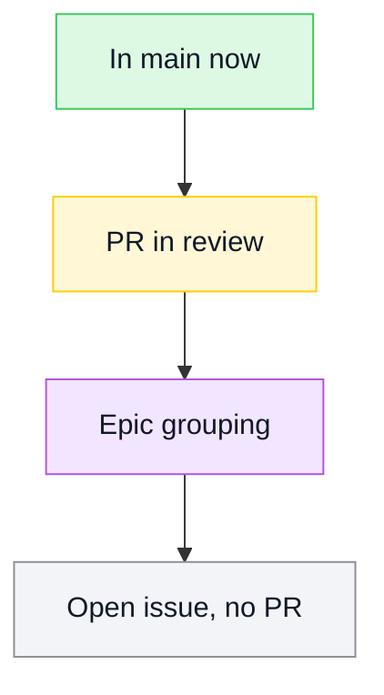
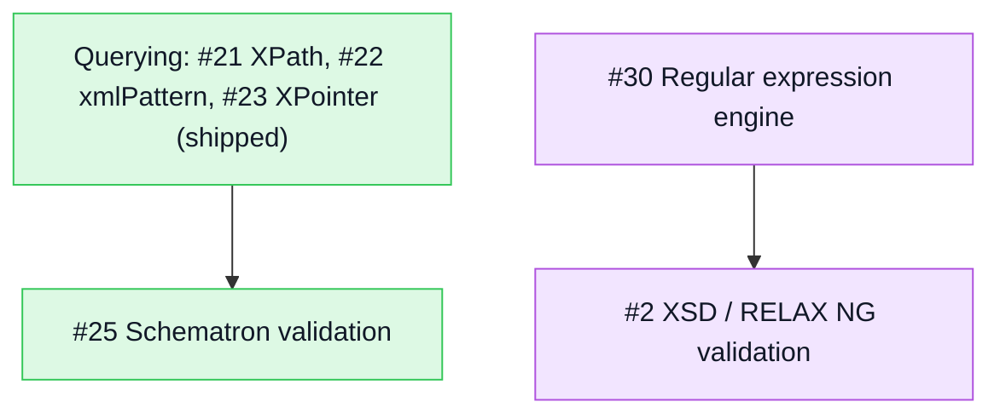
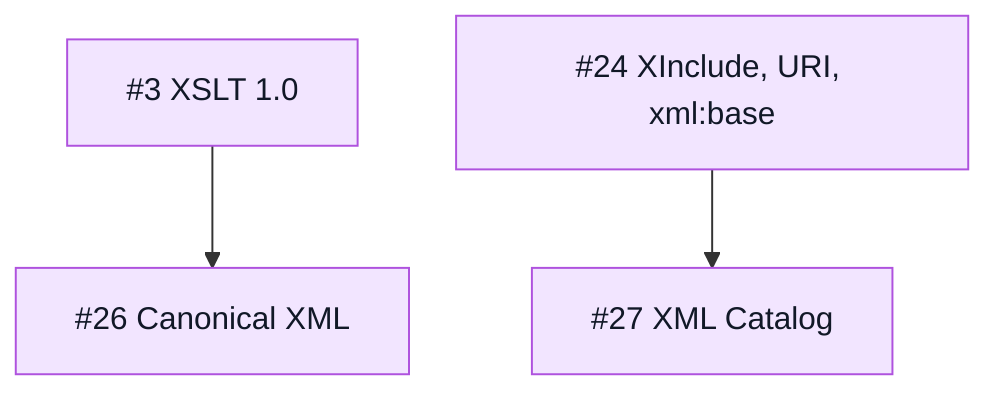

# PureXML

[](https://github.com/mihaelamj/PureXML/actions/workflows/style.yml)
[](https://github.com/mihaelamj/PureXML/actions/workflows/swift-macos.yml)
[](https://github.com/mihaelamj/PureXML/actions/workflows/swift-linux.yml)
[](https://github.com/mihaelamj/PureXML/actions/workflows/swift-windows.yml)
[](https://github.com/mihaelamj/PureXML/actions/workflows/swift-wasm.yml)
[](LICENSE)

PureXML is a dependency-free XML package written entirely in Swift.

The goal is a Linux-, Windows-, and WebAssembly-compatible XML reader/writer that
does not pull in `libxml2`, `expat`, or Foundation's `XMLParser`. The package is
intentionally strict about portability:

- no external SwiftPM dependencies
- no bundled C sources
- no Foundation requirement in the library target
- root Swift package layout
- macOS, Linux, Windows, and WASI build gates

It is a sibling project to [PureYAML](https://github.com/mihaelamj/PureYAML) and
follows the same structure, rules, and verification gates.

## Roadmap

The roadmap uses the TileDown Mermaid palette: green for shipped work, yellow for
review, purple for epic grouping, and gray for open work.



The goal is full libxml2 feature parity in pure Swift with zero dependencies, by
clean-room reimplementation (behavior reproduced from the private PureXML-research
analysis, no upstream source copied). The streaming core plus DTD validation
(content models, attributes, ID/IDREF) and an XPath 1.0 subset is shipped; the
remaining libxml2 surface is tracked as epics. Deliberate non-goals: network
fetching (`nanohttp`/`nanoftp`) and the threading/memory infrastructure stay out,
and external resolution is opt-in through an injected resolver so XXE stays closed.

Parsing and I/O:

```mermaid
flowchart TB
  classDef done fill:#ddf9e4,stroke:#34c759,color:#111827
  classDef review fill:#fff7d6,stroke:#ffcc00,color:#111827
  classDef epic fill:#f2e5ff,stroke:#af52de,color:#111827
  classDef todo fill:#f2f4f7,stroke:#8e8e93,color:#111827
  Core["Streaming core + DTD validation (shipped)"]:::done
  Push["#1 Push / feed streaming API"]:::epic
  Sax["#19 SAX2 push callbacks"]:::done
  Html["#20 HTML parser and serializer"]:::epic
  Enc["#28 Full encoding support"]:::done
  Ent["#29 External and parameter entities"]:::done
  TreeApi["#31 Tree manipulation API"]:::done
  Writer["#32 xmlTextWriter"]:::done
  Reader["#33 xmlTextReader with validation"]:::done
  Save["#34 Serialization option parity"]:::done
  Chars["#35 Character and name validity"]:::done
  Core --> Push
  Core --> Sax
  Core --> Html
  Core --> Enc
  Core --> Ent
  Core --> TreeApi
  Core --> Writer
  Core --> Reader
  Core --> Save
  Core --> Chars
```



Validation:



Transformation and integrity:



## Status

PureXML is a working, dependency-free XML library today: parse, emit, validate,
query, and stream documents on macOS, Linux, Windows, and WASM. The test suite
currently runs **135 tests in 18 suites** (`swift test`).

### Shipped (libxml2-aligned surface)

- **Model** (`PureXML.Model`): `Node`, `Element`, `Attribute`, `QualifiedName`,
  and a mutable `TreeNode` for in-place editing (insert, remove, replace, copy,
  parent navigation).
- **Parsing** (`PureXML.Parsing`): iterative streaming parser over strings,
  bytes, or incremental character/byte sources. Pull events via `EventReader`,
  SAX2-style callbacks via `SAXHandler`, and a pull cursor via `TextReader`
  (libxml2 `xmlTextReader`). Handles elements, attributes, text, predefined and
  numeric entities, comments, CDATA, and processing instructions. Namespace
  bindings (`xmlns`) are resolved to URIs on parse.
- **Encoding**: UTF-8/16/32 (with BOM sniffing), ISO-8859-1, and Windows-1252
  from raw bytes or streaming byte input.
- **DTD (opt-in)**: `<!DOCTYPE>` is **off by default** (`Limits.allowDoctype:
  false`) to keep XXE and entity-expansion closed. When enabled, the internal
  subset is parsed; internal general entities expand with a bounded cap; external
  entities and external subsets are refused unless an injected
  `EntityResolver` supplies replacement text.
- **Validation** (`PureXML.Validation`): structural checks (duplicate attributes,
  etc.) plus **DTD validation** against declared content models, attribute lists,
  and ID/IDREF rules (`DTDSchema`, `validateAgainstInternalDTD`). XSD, RELAX NG,
  and Schematron remain open epics (#2, #25).
- **Emitting** (`PureXML.Emitting`): `Serializer` (save-option parity) and an
  incremental `Writer` (libxml2 `xmlTextWriter`) with compact and pretty modes.
- **XPath** (`PureXML.XPath`): a **subset** of XPath 1.0 (location paths, common
  axes, node tests, basic predicates). Full XPath 1.0 is epic #21.

### Safe defaults

By default the parser rejects `<!DOCTYPE>` and refuses every external reference
(`EntityResolver.refusing`). Enable DTD processing only when you need internal
subset validation or internal entities, and wire a resolver only for trusted,
in-memory replacements. Network fetching (`nanohttp`/`nanoftp`) and libxml2's
threading/memory infrastructure are deliberate non-goals.

### Remaining toward full libxml2 feature parity

**12 of 20 epics are still open**; each now has filed child issues (#4–#60). The
shipped eight cover the core I/O stack; most remaining work is whole standards:

| Open epic | Child issues | What it adds |
|---|---|---|
| #1 Push / feed API | #4–#7 | Resumable scanner + push parser |
| #20 HTML parser | #36–#39 | Tag-soup HTML parse and serialize |
| #21 Full XPath 1.0 | #40–#43 | Unlocks #22, #23, #25, #3 |
| #22 xmlPattern | #44–#45 | Streaming pattern match (needs #21) |
| #23 XPointer | #46–#47 | element() / xpointer() (needs #21) |
| #24 XInclude | #48–#51 | URI, xml:base, xi:include |
| #25 Schematron | #52–#53 | Rule validation (needs #21) |
| #26 C14N | #54–#56 | Canonical XML variants |
| #27 XML Catalog | #57–#58 | OASIS catalog resolver |
| #30 → #2 | #59–#60, #8–#13 | Regex engine, then XSD / RELAX NG |
| #3 XSLT 1.0 | #14–#18 | Stylesheet transform (needs #21) |

**40 open enhancement issues** under those epics (plus the 12 epic parents). Critical
path: **#30 → #2** (schema) and **#21 → #22/#23/#25/#3** (query/transform).

## Usage

```swift
import PureXML

// Build a tree and emit it (works today).
let element = PureXML.Model.Element(
    "book",
    attributes: [.init("id", "bk101")],
    children: [.element(.init("title", children: [.text("XML Developer's Guide")]))],
)

let xml = PureXML.serialize(.element(element))
try PureXML.validate(.element(element))

// Parse it back into a tree.
let node = try PureXML.parse(xml)

// Or stream events without building a tree (drives chunked input too).
var reader = PureXML.events(xml)
while let event = try reader.next() {
    // handle .startElement / .characters / .endElement / ...
}

// DTD validation (opt-in: allowDoctype + optional resolver for trusted externals).
let issues = try PureXML.validateAgainstInternalDTD(
    xmlWithDoctype,
    limits: .init(allowDoctype: true),
)

// XPath subset over a parsed tree.
let titles = try PureXML.xpath("//title", over: node)
    .compactMap(\.element)
```

## Attribution

PureXML is informed by the behavior of established XML parsers (`libxml2`,
`expat`, Foundation's `XMLParser`) and by the W3C XML 1.0 specification, but it
does not copy their implementation into `Sources/`. See
[ATTRIBUTION.md](ATTRIBUTION.md).

## Development Contract

PureXML must stay dependency-free and portable. Before merging changes:

- Swift tools version: 6.1
- Package products: `PureXML`
- SwiftPM dependencies: none
- Hosted CI matrix: macOS, Linux, Windows, and WASM

```sh
bash scripts/check-all.sh
```

That command expands to:

```sh
bash scripts/check-style.sh
bash scripts/check-namespacing.sh
bash scripts/check-forbidden-patterns.sh
swiftformat . --config .swiftformat --lint
swiftlint --config .swiftlint.yml --strict
swift build
swift test
```

## License

MIT.
